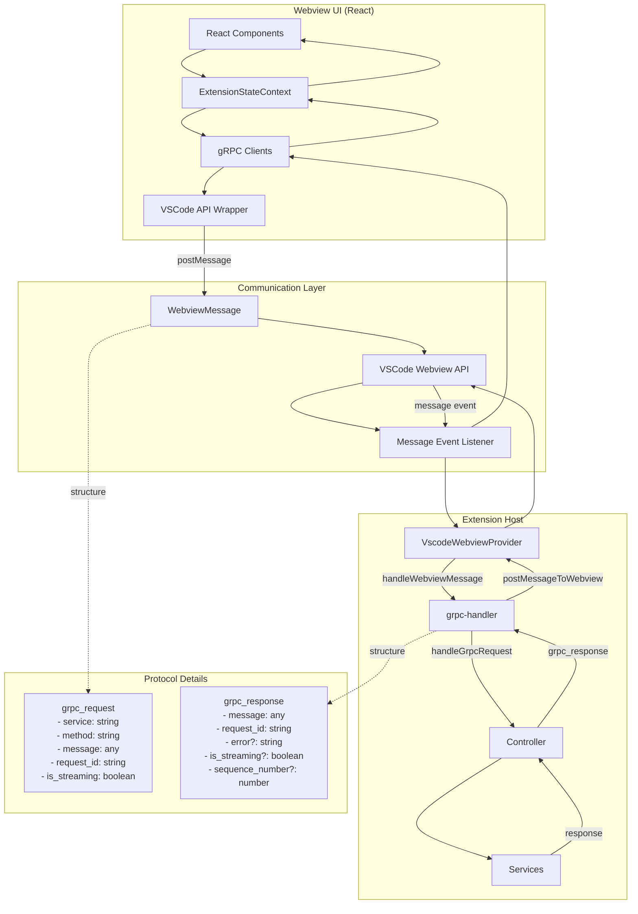
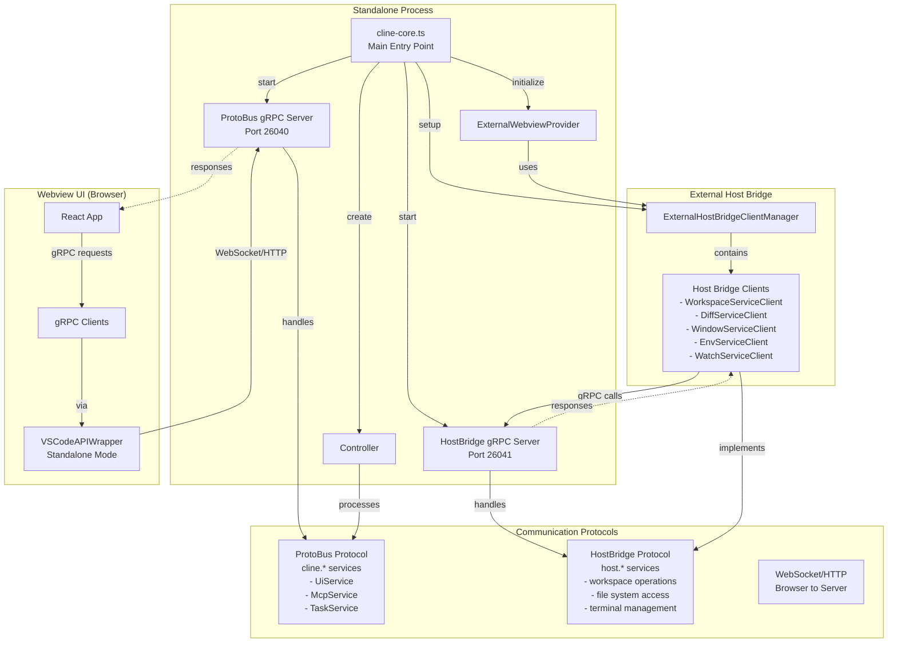

## webview-ui 到核心服务交互流向图

## 详细交互流程

### 1. 前端发起请求
webview-ui 中的 React 组件通过 `ExtensionStateContext` 调用 gRPC 客户端 [1](#2-0) 。

### 2. 消息封装与传递
gRPC 客户端使用 `VSCodeAPIWrapper` 将请求封装为 `WebviewMessage` 格式 [2](#2-1) ，然后通过 VSCode 的 webview API 发送 [3](#2-2) 。

### 3. 后端消息处理
`VscodeWebviewProvider` 接收消息并路由到 `grpc-handler` [4](#2-3) 。

### 4. gRPC 请求处理
`grpc-handler` 根据请求类型分发到相应的处理函数 [5](#2-4) ：
- **一元请求**：`handleUnaryRequest` 处理单次请求响应 [6](#2-5) 
- **流式请求**：`handleStreamingRequest` 处理持续数据流 [7](#2-6) 

### 5. 响应回传
处理完成后，响应通过相同路径返回到前端，前端通过消息监听器接收并更新状态 [8](#2-7) 。

## 协议格式

### 请求协议 (WebviewMessage) [9](#2-8) 

### 响应协议 (ExtensionMessage) [10](#2-9) 

## Notes

这个架构实现了类型安全的双向通信，支持一元和流式两种 gRPC 模式。VSCode 环境和 standalone 模式使用相同的 gRPC 协议，只是底层消息传递机制不同 [11](#2-10) 。

Wiki pages you might want to explore:
- [Architecture Overview (cline/cline)](/wiki/cline/cline#1.3)
- [WebView Integration and Communication (cline/cline)](/wiki/cline/cline#2.3)

## standalone
根据你的要求，我来画一个 standalone 模式下各组件之间的详细交互流向图。

## Standalone 模式架构交互图

## 详细交互流程

### 1. 启动初始化
standalone 模式通过 `cline-core.ts` 启动整个系统 [1](#3-0) 。系统首先设置 `HostProvider`，然后初始化 webview provider 并启动 ProtoBus 服务。

### 2. HostProvider 设置
在 `setupHostProvider()` 中，系统创建 `ExternalWebviewProvider` 和 `ExternalHostBridgeClientManager` [2](#3-1) 。

### 3. ProtoBus gRPC 服务
`startProtobusService()` 启动监听端口 26040 的 gRPC 服务器 [3](#3-2) ，处理来自 webview-ui 的 `cline.*` 服务请求。

### 4. HostBridge 客户端管理
`ExternalHostBridgeClientManager` 创建各种 host bridge 客户端 [4](#3-3) ，这些客户端连接到端口 26041 的 HostBridge 服务器。

### 5. gRPC 请求处理
ProtoBus 服务使用包装器函数处理一元和流式请求 [5](#3-4) ，将 Promise 基础的处理器转换为 gRPC 兼容的回调风格。

### 6. 流式响应处理
对于流式请求，系统使用专门的包装器处理多个响应 [6](#3-5) 。

## 协议分层

### ProtoBus 协议 (端口 26040)
- **服务范围**：`cline.*` 服务（UI、MCP、任务管理等）
- **通信方向**：Webview UI → Core Services
- **协议类型**：gRPC over WebSocket/HTTP

### HostBridge 协议 (端口 26041)  
- **服务范围**：`host.*` 服务（文件系统、终端、环境等）
- **通信方向**：Core Services → Host Bridge Services
- **协议类型**：gRPC over TCP

## Notes

在 standalone 模式下，系统运行两个独立的 gRPC 服务器：ProtoBus 处理前端到核心的通信，HostBridge 处理核心到主机服务的通信。这种分离设计使得系统可以在没有 VSCode 的环境下独立运行，同时保持与 VSCode 模式相同的 API 接口。

Wiki pages you might want to explore:
- [Development and Extensibility (cline/cline)](/wiki/cline/cline#7)

Wiki pages you might want to explore:
- [Development and Extensibility (cline/cline)](/wiki/cline/cline#7)