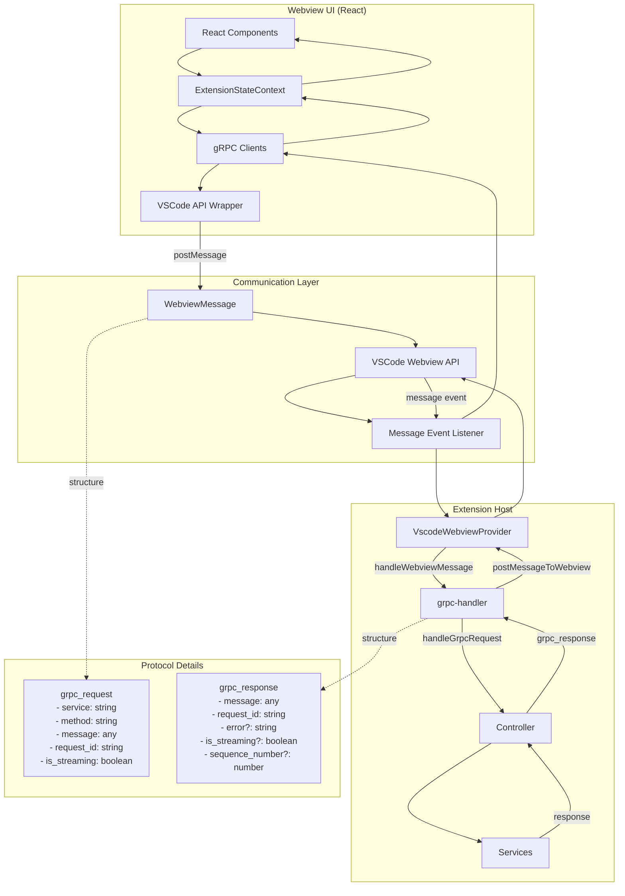

## webview-ui 到核心服务交互流向图

## 详细交互流程

### 1. 前端发起请求
webview-ui 中的 React 组件通过 `ExtensionStateContext` 调用 gRPC 客户端 [1](#2-0) 。

### 2. 消息封装与传递
gRPC 客户端使用 `VSCodeAPIWrapper` 将请求封装为 `WebviewMessage` 格式 [2](#2-1) ，然后通过 VSCode 的 webview API 发送 [3](#2-2) 。

### 3. 后端消息处理
`VscodeWebviewProvider` 接收消息并路由到 `grpc-handler` [4](#2-3) 。

### 4. gRPC 请求处理
`grpc-handler` 根据请求类型分发到相应的处理函数 [5](#2-4) ：
- **一元请求**：`handleUnaryRequest` 处理单次请求响应 [6](#2-5) 
- **流式请求**：`handleStreamingRequest` 处理持续数据流 [7](#2-6) 

### 5. 响应回传
处理完成后，响应通过相同路径返回到前端，前端通过消息监听器接收并更新状态 [8](#2-7) 。

## 协议格式

### 请求协议 (WebviewMessage) [9](#2-8) 

### 响应协议 (ExtensionMessage) [10](#2-9) 

## Notes

这个架构实现了类型安全的双向通信，支持一元和流式两种 gRPC 模式。VSCode 环境和 standalone 模式使用相同的 gRPC 协议，只是底层消息传递机制不同 [11](#2-10) 。

Wiki pages you might want to explore:
- [Architecture Overview (cline/cline)](/wiki/cline/cline#1.3)
- [WebView Integration and Communication (cline/cline)](/wiki/cline/cline#2.3)