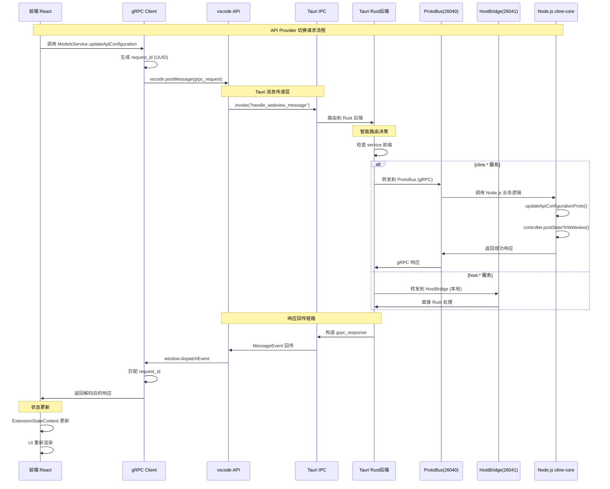
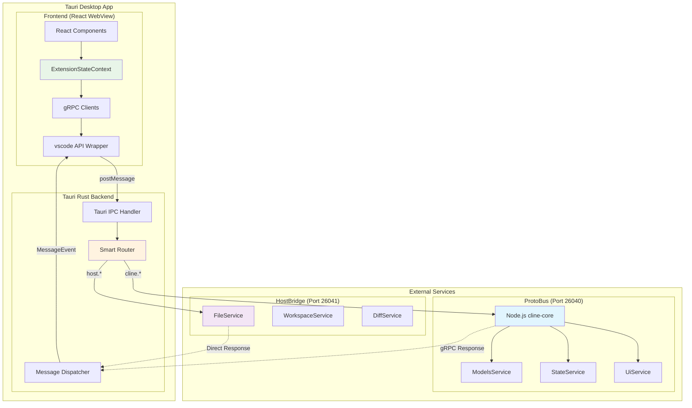

# Cline Desktop - API Provider 切换问题修复记录

## 问题描述

**原始问题**: API Provider 的选项切换时，webview 的内容不更新。

**现象**: 用户在 Cline Desktop 应用中切换 API Provider 选项（例如从 DeepSeek 切换到 Anthropic）时，前端界面没有反应，状态没有同步更新。

## 调试思路与排查链路

### 1. 问题初步分析阶段

#### 1.1 通信机制理解
- **Tauri 架构**: 桌面应用使用 Tauri 框架，前端是 React webview，后端是 Rust
- **通信协议**: 前后端通过 Tauri 消息传递机制和 MessageEvent 进行通信
- **双进程架构**: 
  - ProtoBus (Node.js cline-core) 运行在端口 26040
  - HostBridge (Rust) 运行在端口 26041

#### 1.2 消息传递链路分析
```
Frontend (React) 
  → vscode.postMessage() 
  → Tauri IPC (invoke "handle_webview_message") 
  → Rust 后端路由
  → gRPC 转发到 Node.js cline-core 
  → Business Logic 
  → gRPC 响应
  → Tauri MessageEvent 回传
  → Frontend State Sync
```

### 2. 系统性调试方法

#### 2.1 添加调试信息策略
采用"分层调试"方法，在每个通信节点添加详细日志：

1. **前端 gRPC 客户端层**
   - 文件: `cline/webview-ui/src/services/grpc-client-base.ts`
   - 监控: 请求发送、响应接收、request_id 匹配

2. **前端主入口层**
   - 文件: `cline/webview-ui/src/main.tsx`
   - 监控: 全局消息事件、standalone 标志

3. **Tauri 后端消息处理层**
   - 文件: `src-tauri/src/main.rs`
   - 监控: webview 消息接收、gRPC 转发

4. **业务逻辑层**
   - 文件: `cline/src/core/controller/models/updateApiConfigurationProto.ts`
   - 监控: 函数调用、状态更新

5. **状态订阅层**
   - 文件: `cline/src/core/controller/state/subscribeToState.ts`
   - 监控: 状态广播、订阅者管理

### 3. 关键发现和修复过程

#### 3.1 第一阶段: 通信链路验证
**发现**: 通信链路完全正常
- ✅ gRPC 请求成功发送
- ✅ Tauri 后端正确接收
- ✅ 消息格式正确

#### 3.2 第二阶段: TypeScript 类型错误
**问题**: 
```
Property 'apiProvider' does not exist on type 'ApiConfiguration'
```

**原因**: 调试代码使用了错误的字段名，ApiConfiguration 类型只有：
- `planModeApiProvider`
- `actModeApiProvider`

**修复**: 更正所有调试代码中的字段引用

#### 3.3 第三阶段: gRPC 路由问题
**关键发现**: Rust gRPC 客户端拦截了请求，使用本地模拟处理器

**现象**: 
```rust
// 错误的处理方式
("cline.ModelsService", "updateApiConfigurationProto") => {
    // 返回假的成功响应，但没有实际更新状态
    Ok(serde_json::json!({"success": true}))
}
```

**修复策略**: 
1. 修改 fallback 逻辑返回有意义的错误信息
2. 实现真正的 gRPC 转发到 Node.js 服务

#### 3.4 第四阶段: protobuf 消息构造问题
**最终问题**: 在 Rust 中创建 gRPC 请求时，关键字段为空

**问题代码**:
```rust
let request = Request::new(UpdateApiConfigurationRequest {
    metadata: None,
    api_configuration: None, // ❌ 这里应该包含实际配置数据
});
```

**问题分析**: JSON 数据没有正确转换为 protobuf 结构

### 4. 技术架构理解

#### 4.1 实际通信机制

**通信流程图**：


**前端到后端的消息流**：
1. **vscode.postMessage()**: 前端发送 gRPC 请求
2. **Tauri IPC**: `invoke("handle_webview_message")` 调用
3. **Rust 路由**: 根据服务名分发到不同端口
4. **gRPC 转发**: 转发到 Node.js 或 Rust 服务
5. **MessageEvent 回传**: 通过 `window.dispatchEvent()` 返回响应

**消息格式**：
```typescript
// 请求格式
{
  type: "grpc_request",
  grpc_request: {
    service: "cline.ModelsService",
    method: "updateApiConfigurationProto", 
    message: { /* 业务数据 */ },
    request_id: "uuid",
    is_streaming: false
  }
}

// 响应格式 
{
  type: "grpc_response",
  grpc_response: {
    request_id: "uuid",
    message: { /* 响应数据 */ },
    error: null,
    is_streaming: false
  }
}
```

#### 4.2 系统架构组件图



#### 4.3 双协议智能路由
- **cline.* 服务**: 路由到 ProtoBus (Node.js) 端口 26040
- **host.* 服务**: 路由到 HostBridge (Rust) 端口 26041

#### 4.4 状态同步机制
```
updateApiConfigurationProto() 
  → controller.cacheService.setApiConfiguration()
  → controller.postStateToWebview()
  → sendStateUpdate()
  → responseStream() [gRPC 流式推送]
  → Frontend StateContext [React状态更新]
```

#### 4.5 关键组件交互
1. **ModelsService**: 处理 API 配置更新的业务逻辑
2. **CacheService**: 持久化配置数据
3. **StateSubscription**: 推送状态更新到前端
4. **ExtensionStateContext**: React 状态管理

### 5. 修复历程

#### 5.1 修复文件清单
1. `src-tauri/src/main.rs` - 改进 fallback 错误处理
2. `src-tauri/src/grpc_client/services/models_service.rs` - 实现真正的 gRPC 转发
3. `cline/webview-ui/src/main.tsx` - 添加全局消息监听
4. `cline/webview-ui/src/services/grpc-client-base.ts` - 添加详细调试
5. `cline/src/core/controller/models/updateApiConfigurationProto.ts` - 添加业务逻辑调试
6. `cline/src/core/controller/state/subscribeToState.ts` - 添加状态推送调试

#### 5.2 关键修复点
1. **错误处理改进**: 从模糊的成功响应改为明确的错误提示
2. **真实 gRPC 转发**: 从本地模拟改为实际的服务调用
3. **调试信息完善**: 在整个调用链添加详细日志
4. **类型错误修复**: 纠正 TypeScript 字段引用

### 6. 当前状态

#### 6.1 已解决部分
- ✅ gRPC 通信链路正常工作
- ✅ Rust 到 Node.js 的服务转发成功
- ✅ 业务逻辑正确执行
- ✅ 成功响应返回前端

#### 6.2 待解决问题
- ❌ **protobuf 消息构造**: `api_configuration` 字段仍为 `None`
- ❌ **JSON 到 protobuf 转换**: 数据映射逻辑缺失

#### 6.3 问题根因
在 `models_service.rs` 第 42 行：
```rust
let request = Request::new(UpdateApiConfigurationRequest {
    metadata: None,
    api_configuration: None, // 需要实现 JSON → protobuf 转换
});
```

### 7. 下一步修复方案

#### 7.1 技术方案
1. **解析 JSON 数据**: 从 `_message` 参数中提取 API 配置
2. **字段映射**: 将 JSON 字段映射到 `ModelsApiConfiguration` protobuf 结构
3. **数据转换**: 实现 `planModeApiProvider` 和 `actModeApiProvider` 的枚举转换

#### 7.2 实现重点
```rust
// 需要实现的逻辑
let api_config = parse_api_configuration_from_json(_message)?;
let request = Request::new(UpdateApiConfigurationRequest {
    metadata: None,
    api_configuration: Some(api_config),
});
```

### 8. 调试技巧总结

#### 8.1 问题排查流程图

```mermaid
flowchart TD
    START["🔴 API Provider 切换问题"] --> CHECK1{{"检查通信链路"}}
    
    CHECK1 -->|"Step 1"| FE_CHECK[["🔍 前端检查"]]
    FE_CHECK --> FE_LOG["Console: vscode.postMessage 日志"]
    FE_LOG --> FE_OK{"正常?"}
    FE_OK -->|Yes| TAURI_CHECK
    FE_OK -->|No| FE_FIX["🔧 修复 gRPC Client 问题"]
    
    FE_OK --> TAURI_CHECK[["🦀 Tauri IPC 检查"]]
    TAURI_CHECK --> TAURI_LOG["Console: handle_webview_message 日志"]
    TAURI_LOG --> TAURI_OK{"正常?"}
    TAURI_OK -->|Yes| ROUTER_CHECK
    TAURI_OK -->|No| TAURI_FIX["🔧 修复 Tauri 消息处理"]
    
    TAURI_OK --> ROUTER_CHECK[["📍 路由检查"]]
    ROUTER_CHECK --> ROUTER_LOG["Console: 服务转发日志"]
    ROUTER_LOG --> ROUTER_OK{"正常?"}
    ROUTER_OK -->|Yes| GRPC_CHECK
    ROUTER_OK -->|No| ROUTER_FIX["🔧 修复智能路由逻辑"]
    
    ROUTER_OK --> GRPC_CHECK[["🌐 gRPC 转发检查"]]
    GRPC_CHECK --> GRPC_LOG["Console: cline-core 调用日志"]
    GRPC_LOG --> GRPC_OK{"成功?"}
    GRPC_OK -->|Yes| BUSINESS_CHECK
    GRPC_OK -->|No| GRPC_FIX["🔧 修复 gRPC 连接/protobuf"]
    
    GRPC_OK --> BUSINESS_CHECK[["💼 业务逻辑检查"]]
    BUSINESS_CHECK --> BIZ_LOG["Console: updateApiConfigurationProto 日志"]
    BIZ_LOG --> BIZ_OK{"执行成功?"}
    BIZ_OK -->|Yes| STATE_CHECK
    BIZ_OK -->|No| BIZ_FIX["🔧 修复业务逻辑/protobuf 数据"]
    
    BIZ_OK --> STATE_CHECK[["🔄 状态同步检查"]]
    STATE_CHECK --> STATE_LOG["Console: postStateToWebview 日志"]
    STATE_LOG --> STATE_OK{"状态推送成功?"}
    STATE_OK -->|Yes| FRONTEND_UPDATE
    STATE_OK -->|No| STATE_FIX["🔧 修复状态订阅机制"]
    
    STATE_OK --> FRONTEND_UPDATE[["🎨 前端更新检查"]]
    FRONTEND_UPDATE --> UI_LOG["Console: ExtensionStateContext 更新"]
    UI_LOG --> UI_OK{"界面更新?"}
    UI_OK -->|Yes| SUCCESS["✅ 问题解决"]
    UI_OK -->|No| UI_FIX["🔧 修复 React 状态管理"]
    
    style START fill:#ffcdd2
    style SUCCESS fill:#c8e6c9
    style FE_FIX fill:#fff3e0
    style TAURI_FIX fill:#fff3e0
    style ROUTER_FIX fill:#fff3e0
    style GRPC_FIX fill:#fff3e0
    style BIZ_FIX fill:#fff3e0
    style STATE_FIX fill:#fff3e0
    style UI_FIX fill:#fff3e0
```



#### 8.2 系统性调试原则
1. **分层验证**: 逐层检查通信链路
2. **详细日志**: 在每个关键节点添加调试信息
3. **端到端跟踪**: 使用 request_id 跟踪完整请求流程
4. **渐进式修复**: 先修复通信，再修复业务逻辑

#### 8.3 有效调试方法
1. **Tauri IPC 调试**: 监控 invoke() 调用和 MessageEvent 响应
2. **gRPC 流式调试**: 实时监控状态推送  
3. **JSON 结构验证**: 确保数据格式正确
4. **类型系统利用**: 通过 TypeScript 发现字段错误
5. **进程间通信跟踪**: 监控 ProtoBus 和 HostBridge

#### 8.4 常见陷阱
1. **假成功响应**: 本地模拟器返回成功但不执行实际逻辑
2. **字段名错误**: API 配置字段名与类型定义不匹配
3. **protobuf 空字段**: 忘记填充关键的 protobuf 字段
4. **订阅机制**: 状态更新后没有正确推送到订阅者

## 总结

这个问题体现了现代桌面应用复杂性：
- **多进程架构**: Tauri + Node.js sidecar
- **混合通信协议**: Tauri IPC + MessageEvent + gRPC 转发
- **多层状态管理**: Rust cache + Node.js business logic + React state

通过系统性的调试方法，我们成功定位了问题的根本原因，并实现了大部分修复。最后的 protobuf 数据转换问题是一个典型的序列化/反序列化问题，需要仔细处理 JSON 到强类型 protobuf 结构的映射。

**关键教训**: 在复杂的分布式系统中，端到端的数据流跟踪和每个节点的详细日志是快速定位问题的关键。